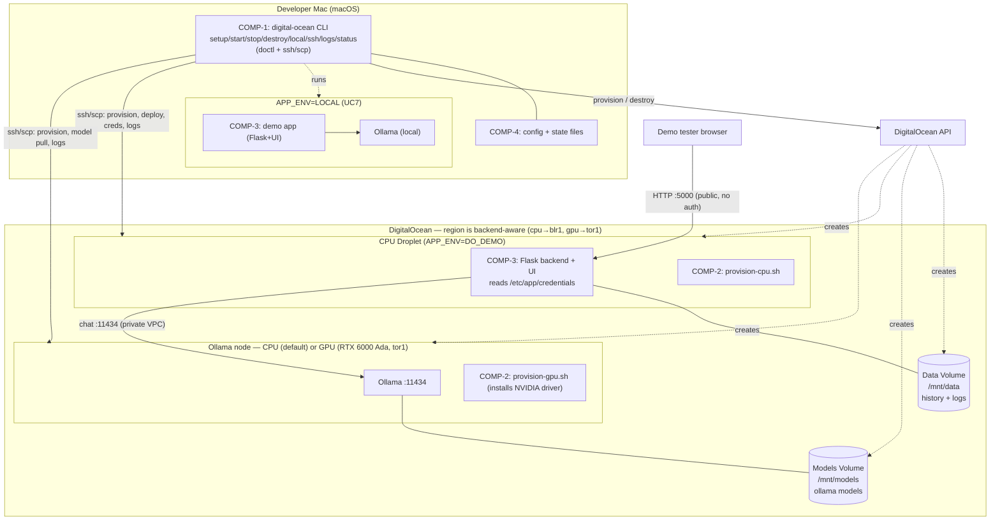

# Architecture Overview — DigitalOcean Demo Host (`digital-ocean` CLI + `demo` app)

> Traces to: `discovery/concept.md`, `discovery/use-cases.md`
> Status: DRAFT for architecture-gate review
>
> **Rename (2026-08-10):** control CLI `demo` → **`digital-ocean`** (COMP-1);
> reference chatbot → **the `demo` app** (COMP-3, `demo/`).

## 1. Capability map (from Gate 1)

| # | Capability | Serves | Component |
|---|---|---|---|
| C1 | CLI framework (`--help/--verbose`, strict mode, idempotent) | all | COMP-1 |
| C2 | Local preflight (tools, DO auth, SSH key, creds file) | UC1 | COMP-1 |
| C3 | Config interview + local config file | UC1 | COMP-1/4 |
| C4 | Local state store (droplet/volume IDs, IPs) | UC2–4, UC6 | COMP-1/4 |
| C5 | Volume lifecycle (ensure/create/attach/detach) | UC2–4 | COMP-1 |
| C6 | Droplet lifecycle (create w/ SSH key, destroy) | UC2–4 | COMP-1 |
| C7 | Dependency provisioning over SSH | UC2 | COMP-2 |
| C8 | Model fetch (`ollama pull`, first-run-only) | UC2 | COMP-1→2 |
| C9 | Credentials injection (local file → droplet) | UC2 | COMP-1 |
| C10 | App deploy + configure (`APP_ENV=DO_DEMO`) | UC2 | COMP-1→3 |
| C11 | Service start + health checks | UC2 | COMP-1/2 |
| C12 | Teardown (droplets-only vs +volumes) | UC3, UC4 | COMP-1 |
| C13 | Chat UI (Flask-served, relative URLs) | UC5 | COMP-3 |
| C14 | Backend + conversation history (→ `/mnt/data`) | UC5 | COMP-3 |
| C15 | Ollama chat integration | UC5 | COMP-3 |
| C16 | `APP_ENV` config layer (LOCAL/DO_DEMO) | UC2, UC5, UC7 | COMP-3 |
| C17 | Logging to persistent volume | UC5, UC6 | COMP-3/2 |
| C18 | SSH/SCP debug helpers (`ssh|logs|status`) | UC6 | COMP-1 |
| C19 | Local-run orchestration (`digital-ocean local`) | UC7 | COMP-1 |

Every use case (UC1–UC7) is served by ≥1 capability; nothing floats.

## 2. Components

| ID | Component | Runtime | Owns | Language |
|---|---|---|---|---|
| **COMP-1** | **`digital-ocean` control CLI** | Mac (macOS) | C1–C6, C8–C12, C18, C19 orchestration | zsh/bash (portable) |
| **COMP-2** | **Provisioning scripts** | Ubuntu droplets | C7, C11 (Linux side), C17 dirs | bash (Ubuntu) |
| **COMP-3** | **`demo` app** (chatbot) | CPU droplet **and** Mac | C13–C16, C17 (app logging) | Python/Flask + HTML |
| **COMP-4** | **Config & state schema** | Mac (files) | C3, C4 formats | JSON/env files |
| **COMP-5** | **Docs** (README prerequisites + usage) | — | Prerequisites NFR, CLI help | Markdown |

**DO infra resources** (provisioned, not authored): CPU Droplet, GPU Droplet,
two Block Storage Volumes, SSH key, optional private VPC — all managed by COMP-1
via `doctl`.

### Boundary discipline (Mac ↔ Linux)
- COMP-1 runs **only on macOS**; COMP-2 runs **only on Ubuntu**. They never share
  shell code — COMP-1 SSHes in and invokes COMP-2 on the droplet.
- COMP-3 is OS-portable (Python/Flask + Ollama client) — same code runs on the
  Mac (`APP_ENV=LOCAL`, UC7) and the CPU droplet (`APP_ENV=DO_DEMO`, UC5).

## 3. Container diagram (C4-ish)

## 4. Key flows
- **`digital-ocean local` (UC7):** CLI → local venv + local Ollama → Flask on
  localhost. No DO. Proves parity + dependency tracking before any spend.
- **`digital-ocean start` (UC2):** CLI → doctl (volumes, droplets) → ssh provision
  (COMP-2) → ollama pull → scp creds → deploy COMP-3 (`demo` app) → start services
  → health check → print URL + ssh commands.
- **Chat (UC5):** browser → CPU:5000 → backend appends history (`/mnt/data`) →
  Ollama on GPU:11434 → reply streamed back.
- **`digital-ocean stop` (UC3):** destroy droplets, keep volumes.
  **`digital-ocean destroy` (UC4):** also volumes + snapshots.

## 5. Which region? (backend-aware — ADR 0008)
You never pick a region directly — **the Ollama backend picks it**, because no
single DO region can host both backends (verified live with `doctl`):

- **`gpu` → `tor1` (Toronto).** The only *affordable, actually-launchable* DO GPU
  is the RTX 6000 Ada (48 GB, $1.57/hr), and it is **tor1-only**. Bangalore has no
  GPU at all; Amsterdam's cheapest GPU is an H100 at $4.41/hr.
- **`cpu` → `blr1` (Bangalore).** The default (cheap) backend runs its Ollama on a
  16 GB CPU droplet (`s-8vcpu-16gb-amd`). blr1 has it, is India-local, and costs
  the same as Amsterdam — but **tor1 has no 16 GB droplet** (it tops out at 8 GB),
  so the CPU backend cannot live in tor1.

So a GPU demo accepts India→Toronto latency for an affordable GPU; the default CPU
demo stays India-local. An explicit `DO_REGION` still overrides this.

## 6. Cost model
Two parts: **fixed** (volumes persist between demos) + **variable** (compute only
while a demo runs, since `stop` destroys droplets — ADR 0001). Every deployment is
a small **web droplet** plus one **Ollama node** whose size/region follow the
backend.

| Fixed (always billed) | | Variable — while running | |
|---|---|---|---|
| Models volume (50 GB) | $5/mo | Web droplet (small, 4 GB) | ~$0.036/hr |
| Data volume (10 GB, incl. logs) | $1/mo | Ollama node — **cpu** (16 GB, blr1) | ~$0.167/hr |
| **Fixed total** | **~$6/mo** | Ollama node — **gpu** (RTX 6000 Ada 48 GB, tor1) | ~$1.57/hr |

**cpu backend (default):** ≈ $6/mo + **~$0.20/hr** running (~$4.90/day 24×7).
**gpu backend:** ≈ $6/mo + **~$1.61/hr** running — ~8× the CPU path; use it only to
showcase real GPU inference. ⚠️ The GPU left 24/7 ≈ $1,160/mo — always `stop`.
(Current on-demand rates; per-second billing, 5-min minimum.)

## Architecture gate checklist
- [x] Every use case served by ≥1 capability
- [x] Container diagram shows components, connections, boundaries
- [x] Nothing floats (no orphan capability/component)
- [x] **Human approval** (approved)
